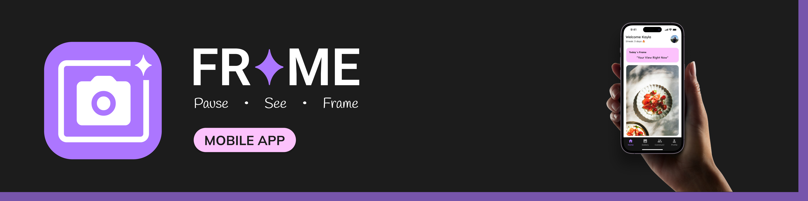
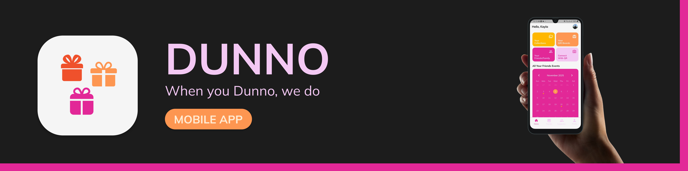
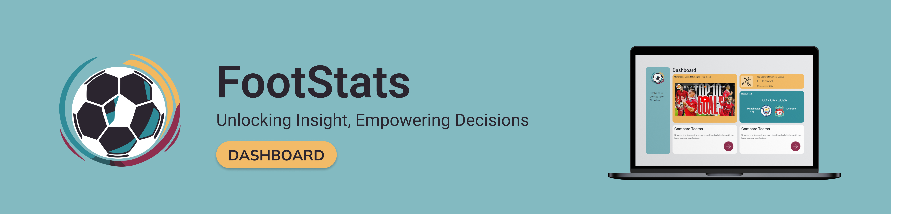
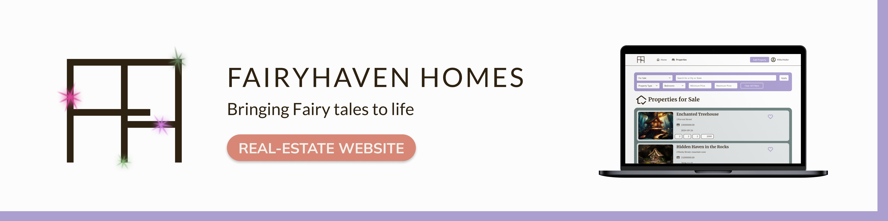
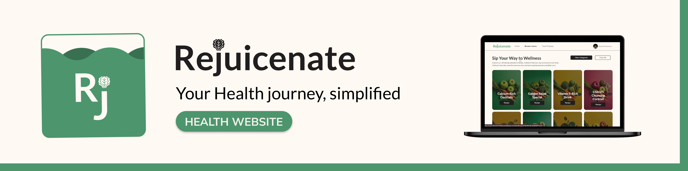

### 👩‍💻 Interactive Developer | 🎨 UX Designer | 🌿 Creative Problem Solver

## ♡ About me ♡

Hello! I'm **Kayla Posthumus**, a passionate **Interactive Developer** and **User Experience Designer** studying at the **Open Window Institute**. I enjoy bringing creative ideas to life through technology and problem-solving at the intersection of **code**, **design**, and **user experience**. From building intuitive mobile apps with **Flutter** to developing full-stack web applications using the **MERN stack**, I thrive on creating elegant solutions that prioritise **human-centered design**. When I'm not coding, you'll find me sketching out ideas in **Figma**, experimenting with new technologies, or enjoying some downtime with my guitar.

> *“Design is everywhere - from the dress you’re wearing to the smartphones you’re holding” - Samandra Ginigi*

📚 **Student** at the **Open Window Institute**  
🎓 **Studying**: Interactive Development & UX Design  
🌱 **Currently learning**: Advanced Flutter patterns, Firebase integrations, and modern backend architecture  
💡 **Passionate about**: Clean UI, mobile-first design, and accessible web experiences  

## ⚙️ Technologies

### ⭐ Main Technologies

### Programming Languages

### Front-End Development

### Back-End Development

### Database Management

### Tools & Libraries

### Creative Tools

### Deployment & Cloud Platforms

## 📊 Statistics

## ♡ My Projects ♡

### 2025 Projects

#### **Semester 1.1 – CoriCore API**

> The RESTful API powering Coriander's HR Management System, built with ASP.NET Core and PostgreSQL. Delivers robust, well-documented endpoints for comprehensive HR operations, complete with Swagger documentation and thorough test coverage.

**Tech:** ASP.NET Core 9.0 • C# • PostgreSQL • Entity Framework Core • JWT & Google OAuth • BCrypt • MailKit • Swagger • xUnit • Docker

🔗 **[Repo](https://github.com/WolfOWI/coriander)**

#### **Semester 1.2 – Coriander HR**

> A modern desktop HR platform developed with Electron, React, and TypeScript. Simplifies workforce management through seamless leave tracking, meeting scheduling, equipment oversight, and performance assessment tools.

**Tech:** Flutter • Dart • Firebase • BLoC • pub.dev packages

🔗 **[Repo](https://github.com/WolfOWI/coriander)**

#### **Semester 2.1 – Frame**

> A social creativity platform that fosters daily creative expression through prompts, frames, and community engagement. Track your creative streak, share your work, and connect with fellow creators.

**Tech:** React • Electron • TypeScript • Vite • Ant Design • Tailwind CSS • Material-UI Icons • MUI X Charts • Google OAuth • Axios • Day.js • Jest • React Testing Library • PDFMake • Lottie React

🔗 **[Repo](https://github.com/KaylaPosthumusOW/frame_app)**

#### **Semester 2.2 – DUNNO**

> AI-powered gift suggestion platform that eliminates the guesswork from gift-giving through personalised recommendations based on friend collections and preferences.

**Tech:** Flutter • Dart • Firebase • OpenAI GPT • BLoC • pub.dev packages  • Lottie

🔗 **[Repo](https://github.com/KaylaPosthumusOW/dunno_app)**

### 2024 Projects

#### **Term 1 – FootStats**

> A football data visualisation platform with real-time, interactive graphs.

**Tech:** React • Express • Chart.js • Axios  
🔗 **[Repo](https://github.com/KaylaPosthumusOW/FootStats.git)**

#### **Term 2 – Exhibito**

> MERN stack exhibition manager that allows art houses to create and manage exhibitions.

**Tech:** MongoDB • Express • React • Node.js • Tailwind • JWT  
🔗 **[Repo](https://github.com/WolfOWI/exhibito.git)**

#### **Term 3 – FairyHaven Homes**

> A whimsical UX-focused property management system with secure authentication.

**Tech:** MERN Stack  
🔗 **[Repo](https://github.com/KaylaPosthumusOW/FairyHaven_Homes)**

#### **Term 4 – Rejuicenate**

> A wellness & nutrition platform with progress tracking, gamification, and personalised juices.

**Tech:** MERN • React Bootstrap • JWT • Confetti  
🔗 **[Repo](https://github.com/KaylaPosthumusOW/Rejuicenate.git)**

## ♡ Let's Connect

*With ♡ by Kayla Posthumus*

