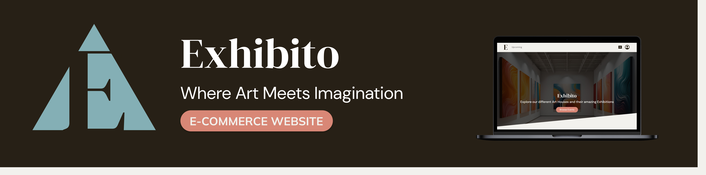
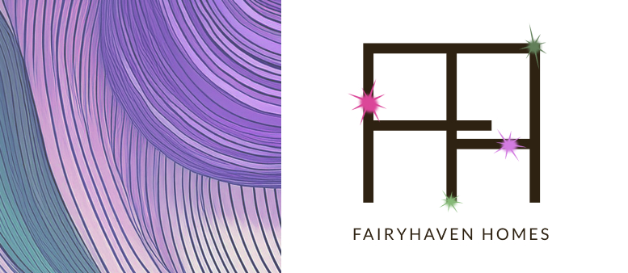

# Hi there, I'm Kayla!

🌿 ~ ~ ~ ~ ~ ~ ~ ~ ~ ~ ~ ~ ~ ~ ~ 🌿

## 🌸 About Me

- 🎓 Studying Interactive Development and UX Design at Open Window Institute
- 💻 Coding with JavaScript, React, and Node.js
- 🎸 Guitar player, tech enthusiast, and lifelong learner

🌿 ~ ~ ~ ~ ~ ~ ~ ~ ~ ~ ~ ~ ~ ~ ~ 🌿

## 🛠️ My Favorite Tools

  

🌿 ~ ~ ~ ~ ~ ~ ~ ~ ~ ~ ~ ~ ~ ~ ~ 🌿

## 🌼 Featured Projects

**Term 1** - FootStats

FootStats visualizes football match data through dynamic line graphs that update based on user-selected metrics such as goals, cards, substitutions, and inactivity.

**Technologies Used:** - React, Express JS, Node JS, Chart.js React Chart.js 2, Axios, React Router

**Project Link** - [FootStats Github Repository](https://github.com/KaylaPosthumusOW/FootStats.git)

~ 🌼 ~

**Term 2** - Exhibito

Exhibito is a MERN stack application developed as part of a 4-person team project. The website allows art houses to manage exhibitions with full CRUD (Create, Read, Update, Delete) functionality, while enabling users to explore and engage with a variety of art events.

**Technologies Used:** MongoDB, Express JS, React, Node JS, Axios, Tailwind CSS, React Bootstrap, React Router, JWT, BCrypt, CORS.

**Project Link** - [Exhibito Github Repository](https://github.com/WolfOWI/exhibito.git)

~ 🌼 ~

**Term 3** - FairyHaven Homes

Exhibito is a MERN stack application developed as part of a 4-person team project. The website allows art houses to manage exhibitions with full CRUD (Create, Read, Update, Delete) functionality, while enabling users to explore and engage with a variety of art events.

**Technologies Used:** MongoDB, Express JS, React, Node JS, Axios, React Bootstrap, React Router, JWT, BCrypt, CORS.

**Project Link** - [FairyHaven Homes Github Repository](https://github.com/WolfOWI/exhibito.git)

~ 🌼 ~

**Term 4** - Rejuicenate

Rejuicenate is a wellness app designed to simplify and enhance your health journey. With personalised juice plans, progress tracking, and tailored recommendations, Rejuicenate makes healthy living accessible and motivating. Explore juices, track your goals, and enjoy a more mindful approach to nutrition—all in one intuitive, responsive platform.

**Technologies Used:** MongoDB, Express JS, React, Node JS, Axios, React Bootstrap, React Router, JWT, bcryptjs, CORS, React Confetti, React Modal, UUID.

**Project Link** - [Rejuicenate Github Repository](https://github.com/KaylaPosthumusOW/Rejuicenate.git)

🌿 ~ ~ ~ ~ ~ ~ ~ ~ ~ ~ ~ ~ ~ ~ ~ 🌿

## 📈 GitHub Stats

🌿 ~ ~ ~ ~ ~ ~ ~ ~ ~ ~ ~ ~ ~ ~ ~ 🌿

## 🌟 My Skills

### Programming Languages

### Front-End Development

### Back-End Development

### Database Management

### Charting & Data Visualization

### Deployment & Cloud Platforms

### Software & Tools

🌿 ~ ~ ~ ~ ~ ~ ~ ~ ~ ~ ~ ~ ~ ~ ~ 🌿

## 📬 Get in Touch

